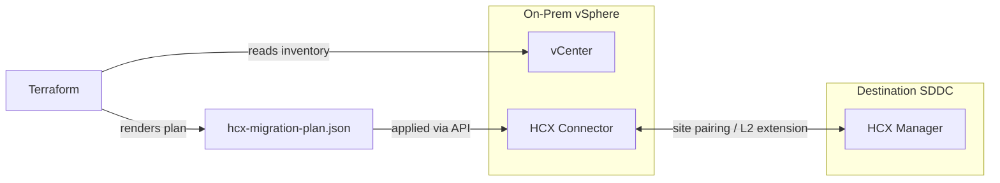

# VMware HCX Automation

[](LICENSE)
[](https://github.com/abhisheksawant52/vmware-hcx-automation/actions/workflows/ci.yml)
[](https://www.terraform.io/)

Infrastructure-as-Code for automating **VMware HCX** workload mobility: site
pairing, Layer-2 network extension, and wave-based VM migration from on-premises
vSphere to a destination cloud SDDC (VMC on AWS, Azure VMware Solution, GCVE).

## Overview

HCX itself is driven through the HCX Connector REST API rather than a native
Terraform provider. This project keeps migration definitions declarative: you
describe the site pairing, network extensions, and migration waves as Terraform
variables, and the configuration renders a versioned `hcx-migration-plan.json`
that your operator tooling or CI applies against the HCX API. The vSphere
provider is used to validate the source datacenter and inventory.

## Architecture



## Features

- Declarative HCX **site pairing** between source and destination.
- **L2 network extension** definitions for stretched subnets.
- **Migration waves** with per-group migration type (bulk / vMotion / cold / RAV).
- Modular Terraform with `dev` and `prod` environments and remote-state config.
- CI: `terraform fmt`, `validate`, and `tflint`.

## Tech Stack

Terraform >= 1.5 · hashicorp/vsphere · hashicorp/local · GitHub Actions

## Getting Started

```bash
cp terraform.tfvars.example terraform.tfvars   # edit values
make init
make plan
terraform apply
```

## Project Structure

```
.
├── main.tf / variables.tf / outputs.tf / providers.tf / versions.tf
├── modules/hcx-migration/     # renders the migration plan
├── environments/{dev,prod}/   # per-env tfvars + backend config
├── docs/usage.md
└── .github/workflows/ci.yml
```

## Configuration

| Variable             | Description                                   |
| -------------------- | --------------------------------------------- |
| `vsphere_server`     | Source vCenter FQDN/IP                        |
| `site_pairing`       | Local/remote HCX system URLs and remote user  |
| `network_extensions` | L2 networks to stretch                        |
| `migration_groups`   | VM groups and their migration type            |

## Deployment

See [docs/usage.md](docs/usage.md) for the full workflow, including applying the
rendered plan against the HCX Connector API.

## Contributing

See [CONTRIBUTING.md](CONTRIBUTING.md) and the [Code of Conduct](CODE_OF_CONDUCT.md).

## Security

Report vulnerabilities per [SECURITY.md](SECURITY.md).

## License

[MIT](LICENSE).
